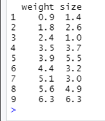
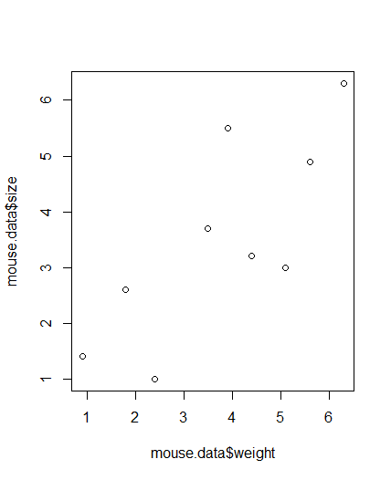
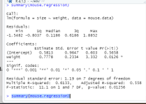
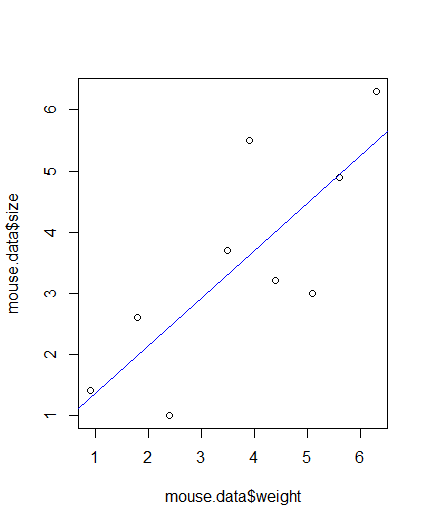
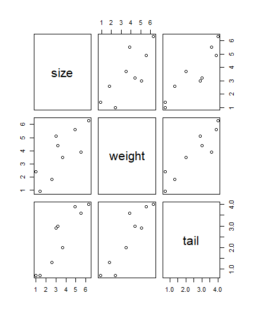
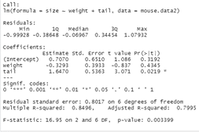

# Simple Linear Regression
- Create the table using mouse data sample 
`mouse.data <- data.frame(` 
&emsp;&emsp;`weight=c(0.9,1.8,2.4,3.5,3.9,4.4,5.1,5.6,6.3)` 
&emsp;&emsp;`size=c(1.4,2.6,1.0,3.7,5.5,3.2,3.0,4.9,6.3)` 
`)`

 

- Plot to see the relationship between size and weight 
`plot(mouse.data$weight, mouse.data$size)` 

- We want to predict size by weight, so we pull up the linear model function 
`mouse.regression <- lm(size ~ weight, data=mouse.data)` 
`summary(mouse.regression)` 

- Then we plot the regression line 

- Then we plot the regression line 

# Multiple Linear Regression
- Create the table with three variables 
`mouse.data2 <- data.frame(` 
&emsp;&emsp;`size=c(1.4,2.6,1.0,3.7,5.5,3.2,3.0,4.9,6.3),` 
&emsp;&emsp;`weight=c(0.9,1.8,2.4,3.5,3.9,4.4,5.1,5.6,6.3),` 
&emsp;&emsp;`tail=c(0.7,1.3,0.7,2.0,3.6,3.0,2.9,3.9,4.0)` 
`)` 

- Plot the data 

We can see the correlation between size(y) and weight(x1) 
We can see the correlation between size(y) and tail(x2) 
We can see the correlation between weight(x1) and tail(x2) 

- We want to predict size using weight and tail 

